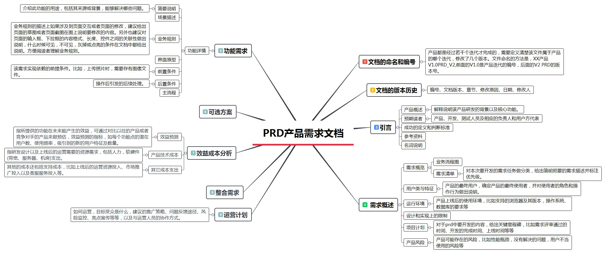
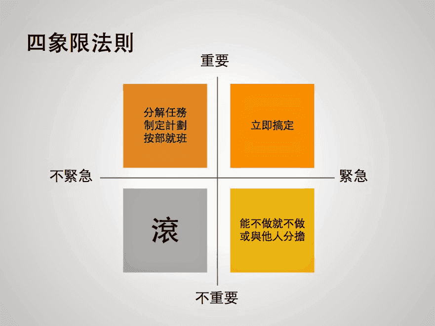

UE(User Experience):用户体验  、  UI(User Interface)：用户界面  ，
RD（Research Development）:研发 ，QA(Quality Assurance)：质量保证/测试 ，UML（Unified Modeling Language）：标准建模语言

产品结构图：主要是辅助设计和技术开发人员了解产品的全局结构，他和用户流程图不一样，产品结构图只是罗列出产品的频道和页面。产品结构图就是产品地图，用思维导图的方式把产品的各个页面罗列出来，但是不需要罗列页面中的内容。

功能结构图：

信息结构图：主要是辅助服务端技术人员创建或调整数据结构的参考文件。信息结构图就是产品数据元素，用思维导图的方式把产品各个数据元素罗列出来，只需要罗列活的数据，固定在页面里的信息数据不需要罗列。

如何确定需求的优先级？（来自产品100）

1.明确自己产品的战略层是什么。与战略层无关的需求，不做或者有时间再做。明确现阶段产品的主要目标是什么？一个产品在每个阶段的重点是不同的，所以，明确你这个阶段身上背的KPI是什么，提升用户数，增加用户转化付费……明确了这个目标，然后再看你收到的那些需求，评估对每一个现阶段目标的贡献程度，如果你现在的KPI是用户数，肯定分享功能重要度要高于评论功能嘛。给需求排优先级S1,S2,S3

2.判断用户影响。1 不做会造成严重的问题和恶劣的影响的

2 做了会产生巨大好处和极佳效果的

3 跟重要合作对象或投资人有关的

4 跟核心用户利益有关的

5 跟大部分用户权益有关的

6 跟效率或成本有关的

7 跟用户体验有关的

判断紧急程度按照以下原则：

1 不做错误会持续发生，造成严重影响

2 在一定时间内可控，但长期会有糟糕的影响

3 做了立刻能解决很多问题、产生正面的影响

4 做了在一段时间后可以有良好的效果

根据重要和紧急程度，给产品划出优先级排序P1,P2,P3

3.评估技术实现成本。一定要找技术部门的同事确认一遍你的功能设计方案，重点确认以下信息：

这个功能咱们能不能实现？
能实现的话，需要多少人多长时间？
有没有其他实现的建议或者方案？
从技术部门同事那里帮你判断了需求实现的容易程度：D1,D2,D3

kano模型：

基本需求：简单的来讲，如果“没有”，用户就会很不满意，如果“有”，用户也不会为此感到满意，毕竟，此类型需求属于“理所当然”的需求

期望需求：此类型需求与基本需求相反，简单的来讲，就是这么一个意思，如果有，则用户会感到满意，如果没有，用户也不会感到失望。

兴奋需求：某种含义上是期望需求的升级版本，有时候我们会提到的超越用户预期，以及 挖掘表面需求背后隐藏的需求，便是指期望需求和兴奋需求的关系。

无差异需求：是指有没有都无所谓的这部分需求，不论提供或者不提供，对用户体验无影响，换言之，即使不做，也不会让客户不满意。

产品结构图，功能结构图，信息结构图？

产品结构图：绘制产品结构图，可以让团队所有成员都能直观的查看和了解产品的各个单元，从而更好的协同配合，掌握所有页面的结构、连接和交互方式。

信息结构图：信息结构图就是产品数据元素，用思维导图的方式把产品各个数据元素罗列出来，只需要罗列活的数据，固定在页面里的信息数据不需要罗列。

安卓iOS设计规范区别：

1.尺寸。界面大小，导航栏，标签栏，图标等尺寸都不一样。
2.单位。iOS的单位是px，安卓的单位是dp
3.导航栏位置。安卓在顶部，防止误触下面实体按键；iOS在顶部。
4.安卓长按删除；iOS左滑删除。

红海和蓝海。红海代表现今存在的所有产业，也就是我们已知的市场空间；蓝海则代表当今还不存在的产业，这就是未知的市场空间。
作者认为：在红海中，每个产业的界限和竞争规则为人们所知。在这里，随着市场空间越来越拥挤，利润和增长的前途也就越来越黯淡。残酷的竞争也让红海变得越发鲜血淋漓。与之相对的是，蓝海代表着亟待开发的市场空间，代表着创造新需求，代表着高利润增长的机会。尽管有些蓝海完全是在已有产业边界以外创建的，但大多数蓝海则是通过在红海内部扩展已有产业边界而开拓出来的。 

产品的调性：是用户对于产品在情感上的整体感知，这种整体感知形象则是通过其各设计要素来体现与强化。从用户与产品的情感交互过程与品牌识别的角度，互联网产品调性体现要素主要包括：品牌、功能、交互、UI与文本以及最重要的产品运营。

## 市场分析：
三要素=客户，购买欲望，购买力。

三点决定市场大小，根据STP理论，市场细分（Segmentation）、目标市场选择（Targeting）和市场定位（Positioning）。

1、市场细分

根据客户特征、场景、需求、行为等因素确定维度，把大的整体市场从客户角度细分成若干小市场，市场细分是产品定位和需求调研的基础。

细分的市场应该有如下特征，否则便是无效市场：

①可衡量性：确定细分市场的标准和维度以及细分后的市场内关键要素必须是可衡量的，不能带有模糊主观，否则细分的市场带有很大的不确定性。

②可进入性：选择的细分市场一定是企业可以进入的市场。

③可盈利性：该细分市场规模足够大，足够使企业进入后盈利或者有很大潜力，否则进入后就得不偿失了。

④差异性：该细分市场和其他细分市场有一定的差别，也就是设计不同的营销方式或者不同产品，市场能有不同反应。

⑤稳定性：细分市场在未来一段时间保持稳定，否则企业进入会有很大风险。

细分市场决定了客户和竞争对手是谁，最佳的细分手段是进入蓝海市场。

2、确定目标市场

确定多个细分市场后，就需要在这些细分市场中选出企业要进入的目标市场了。
选择目标市场时，有个重要因素就是每个细分市场的市场吸引力。市场吸引力高低是由市场规模、市场增长率、竞争情况、发展潜力、盈利性等决定。同时还必须要综合企业内部各项能力，综合考虑后确定目标市场。SWTO分析法，GE矩阵

3、市场定位

确定了目标市场后，就需要给市场定位了。市场定位即产品定位，做完之前的市场细分和选择目标市场的工作后，应该对市场和客户了解已经很深了。在此基础上，结合企业自己的优势，给自己产品定位，如果该细分市场有强大竞争对手的情况下，则需要先对竞争对手的产品进行定位，而后根据市场和自身，寻求差异化。需要注意的是，在产品定位出来后，最好通过和客户探讨等方式，对定位进行一个论证，确定可行性！

在产品定位阶段，仍然建议采用SWOT分析法。

