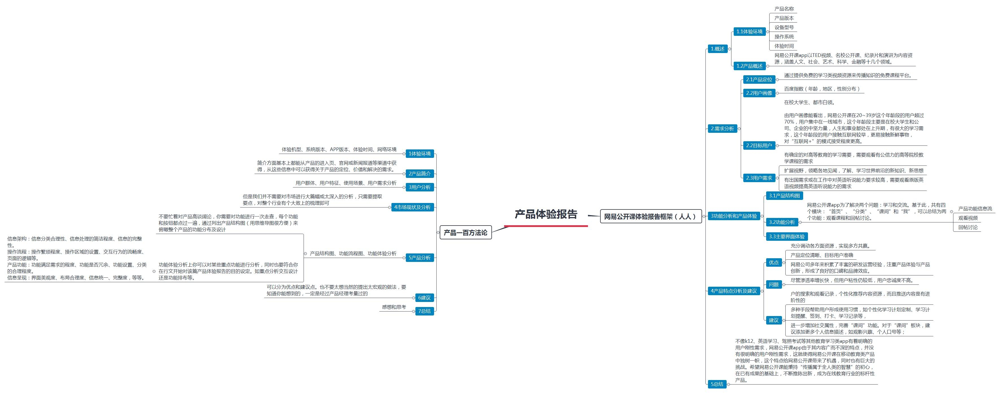
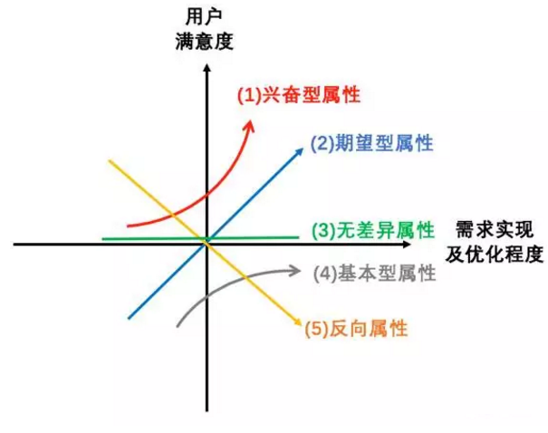

UE(User Experience):用户体验  、  UI(User Interface)：用户界面  ，
RD（Research Development）:研发 ，QA(Quality Assurance)：质量保证/测试 ，UML（Unified Modeling Language）：标准建模语言

产品结构图：主要是辅助设计和技术开发人员了解产品的全局结构，他和用户流程图不一样，产品结构图只是罗列出产品的频道和页面。产品结构图就是产品地图，用思维导图的方式把产品的各个页面罗列出来，但是不需要罗列页面中的内容。

功能结构图：

信息结构图：主要是辅助服务端技术人员创建或调整数据结构的参考文件。信息结构图就是产品数据元素，用思维导图的方式把产品各个数据元素罗列出来，只需要罗列活的数据，固定在页面里的信息数据不需要罗列。

如何确定需求的优先级？（来自产品100）

1.明确自己产品的战略层是什么。与战略层无关的需求，不做或者有时间再做。明确现阶段产品的主要目标是什么？一个产品在每个阶段的重点是不同的，所以，明确你这个阶段身上背的KPI是什么，提升用户数，增加用户转化付费……明确了这个目标，然后再看你收到的那些需求，评估对每一个现阶段目标的贡献程度，如果你现在的KPI是用户数，肯定分享功能重要度要高于评论功能嘛。给需求排优先级S1,S2,S3

2.判断用户影响。1 不做会造成严重的问题和恶劣的影响的

2 做了会产生巨大好处和极佳效果的

3 跟重要合作对象或投资人有关的

4 跟核心用户利益有关的

5 跟大部分用户权益有关的

6 跟效率或成本有关的

7 跟用户体验有关的

判断紧急程度按照以下原则：

1 不做错误会持续发生，造成严重影响

2 在一定时间内可控，但长期会有糟糕的影响

3 做了立刻能解决很多问题、产生正面的影响

4 做了在一段时间后可以有良好的效果

根据重要和紧急程度，给产品划出优先级排序P1,P2,P3

3.评估技术实现成本。一定要找技术部门的同事确认一遍你的功能设计方案，重点确认以下信息：

这个功能咱们能不能实现？
能实现的话，需要多少人多长时间？
有没有其他实现的建议或者方案？
从技术部门同事那里帮你判断了需求实现的容易程度：D1,D2,D3

kano模型：

基本需求：简单的来讲，如果“没有”，用户就会很不满意，如果“有”，用户也不会为此感到满意，毕竟，此类型需求属于“理所当然”的需求

期望需求：此类型需求与基本需求相反，简单的来讲，就是这么一个意思，如果有，则用户会感到满意，如果没有，用户也不会感到失望。

兴奋需求：某种含义上是期望需求的升级版本，有时候我们会提到的超越用户预期，以及 挖掘表面需求背后隐藏的需求，便是指期望需求和兴奋需求的关系。

无差异需求：是指有没有都无所谓的这部分需求，不论提供或者不提供，对用户体验无影响，换言之，即使不做，也不会让客户不满意。

产品结构图，功能结构图，信息结构图？

产品结构图：绘制产品结构图，可以让团队所有成员都能直观的查看和了解产品的各个单元，从而更好的协同配合，掌握所有页面的结构、连接和交互方式。

信息结构图：信息结构图就是产品数据元素，用思维导图的方式把产品各个数据元素罗列出来，只需要罗列活的数据，固定在页面里的信息数据不需要罗列。

