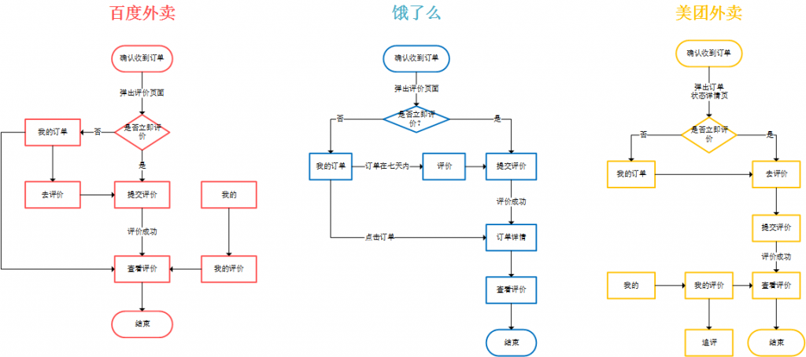
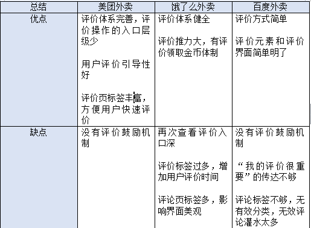

### 作为产品经理，竞品分析是一项基本能力。请对比百度外卖、美团外卖、饿了么的评价功能，做一次竞品分析，说出优势和劣势。

评价在外卖平台中是用户参考的一项重要指标，能直接影响用户购买决策，与商家在平台的销售量关联，一个公正客观的评价体系对商家具有监管作用，提升服务质量，形成产品的良性循环。以下从评价功能逻辑，和评价的内容对比。

1.评价功能逻辑对比

三个平台都在用户确认订单后立即评价，不做比较。比较1.用户初次评价后查看评价 2.用户没有立即评价，后续来评价 3.评价驱动力

1.美团外卖初次评价后，显示订单已完成。查看入口在我的--我的评价。饿了么初次评价后，显示订单已完成，再次查看入口层级深，订单--订单详情--我的评价。百度外卖初次评价后，订单有查看评价标签，我的--我的订单可再次查看。
2.用户初次没有评价时，美团订单页--待评价子页有明显数字标识。饿了么的订单--立即评价，有评价拿金币的明显按钮。百度订单页--去评价。
3.用户的评价驱动力有3点，服务和商品的极端化（体验很好或很差），平台鼓励机制，平台向用户暗示评价很重要。美团有单独的待评价页，我的评价中可以对历史评价分享，追评和删除，对评论的多操作性和功能入口简单，让用户更愿意写评价。饿了么对评价给予金币奖励，可以用来兑换购物券和抽奖，在外卖平台是有效的鼓励。百度外面没有鼓励机制，评价重要性的传达也做得不够。

2.内容对比

美团外卖：购买标签中，美团外卖的五角星评价没有指数，参考意义不大。亮点：店铺评论详情页分了全部、有图、点评三个标签，方便快速查看。单条评论内容简洁。 缺点：点评页是被盖章优质点评的评论，但9999+的评论数量只有7条优质评论，且时间跨度最少的也有2个月，更新得不够及时。
评分内容：口味，包装，配送，固定标签，文字+图片。

饿了么：缺点：店铺购买页中，评价标题无数量标识。单条评论中，满意度表情，购买物品，文字分别使用了4种颜色，使得评论内容纷杂。优点：评论可以互相回复。综合评分有高于周边商家的百分比显示。

百度外卖：优点：界面简洁，评价内容少。缺点：评论数量普遍较少，分类标签少，查看不便捷。

### 请预估在正常星期五的下午14:30分，有多少用户在刷新朋友圈？请重点描述你的理由以及推理过程

不知道怎么回答。多少用户是哪里的用户，武汉的？全国的？我朋友圈的？

运营的二八法则，20%的活跃用户贡献80%的内容，剩余80%的用户贡献了20%的内容。

这种题目被称之为“费米问题”。这种问题的核心就是进行通过科学的假设对于一个信息量有限的问题进行合理估算。网上有很多这样子的题目，比如“全世界需要多少调音师”，比如“北京市需要多少厕所。”回答这种问题的关键不在于你回答任何数字，回答任何数字都是错误的，需要回答的应该是你合理的估算解决问题的关键路径步骤，只要这个是没有问题的，那么再扯的数字都是正确的。

### 芝加哥有多少钢琴师

1.大约有九百万人生活在芝加哥 2.在芝加哥平均每个家庭有两个人 3.大约20个家庭中有一个家庭有定期的需要调刚请 4.定期调琴的钢琴每年需要调整一次
5.每个调琴师工作大约需要2小时，包括路上时间 6.，每个调琴师每天工作8小时，一周5天，一年50周。

通过这些假设我们可以计算出每年在芝加哥需要调整的钢琴数量是（9,000,000人）/（2人一家）*（1架钢琴/20家）*（1架钢琴调整/1年）=225000架钢琴在芝加哥每年被调整。

类似的计算出平均每个调琴师（50周/年）*（5天/天）*（8小时上班）/（1架钢琴2小时）=1000架钢琴每年/1调琴师

相除得225个调琴师在芝加哥

事实上，一共有大约290名调琴师在芝加哥

### 全国有多少个加油站

我的想法：全国有多少人--人车的比例计算出车的数量--一辆车一般加油的频率--一个加油站一天可以给多少车子加油

1.全国有多少辆车
车子分为私家车和公用车。
私家车为小轿车等，
公用车包括公交车，消防车，快递用车，警车等几十种，取10种

我国16亿人口，1人1辆太多，100人一辆太少，取几何平均每10人/辆，那总：1.6亿辆车
现在算一辆公用车能满足多少人需求。10人太少，100人太多，取几何平均30人/辆，那总：5千万辆，加上公用车种类，则5亿。
则全国共有6.6亿辆车。

2.根据经验，一辆车加油频率为3天加一次。

3.假设一个加油站，每天营业时间从早6点到晚10点，营业约20小时。每辆车加油需要5分钟，一个加油站同时可以给6辆车服务，那一个加油站每天服务：20*60/5=240辆，再乘6，约为2000辆。

那一个加油站3天服务：大约6000辆车

4.则计算：6.6亿/6000=11万

和实际结果只差1.8万。

估值的误差期望在一个数量级以内，即10倍。

结果差多少不是很重要，重要的是每一步你的论证和逻辑性，是否可靠。

