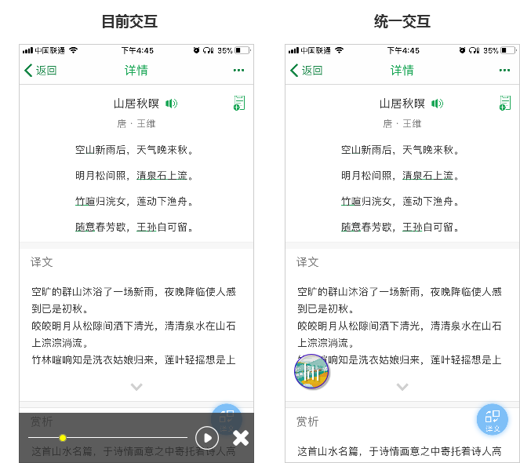

#### 蜻蜓音频引入

在有声诗词的音频，诗词详情页是否和有声诗词统一上，我想了很久，也不太确定。1.如果说详情页改成点击播放跳出悬浮按钮，但对大部分搜索用户来说，这一步是否变得更麻烦了。这样做的好处是退出页面能继续听，但用户听的需求是否只在这首诗详情页时才有，如此这样关闭音频的操作就复杂了几步。还有就是：点击播放按钮，是跳详情页还是弹出悬浮按钮。我感觉是跳详情页才是正确逻辑。弹出悬浮按钮的话，便和app的其他地方不同，但在详情页播放时跳到播放页，似乎是多余的，因为文本详情页也有，这个跳转只是符合逻辑却不符合需求。
2.如果详情页音频的交互不动它，那app里的音频机制就有两套，完全没必要。而且不动的话，有声音频的悬浮按钮出现详情页时再点击详情页播放按钮，就会从按钮转变为bar，不太合理。当时想的解决方案是，悬浮按钮和详情页互斥，这样两套机制就被隔开了。但如果不支持详情页，那悬浮的意义似乎就不大，毕竟详情页是用户访问量很大的地方。
最后的方案是：app里所有音频统一一套机制。详情页点击播放时跳出悬浮按钮，而不是到播放页。

#### 字源传说

字源传说是2.6版时得到的一批数量不大，但还独家和精品的资源，所以在还没有feed流想法的时候，是想让用户尽可能看到这批资源。

图一：当时app没有播放页，考虑为这批资源在首页开辟入口，但资源单一又匮乏，有诸多不合理

图二：这样设计是考虑到内容的扩展，想形成一个资源的闭环，同时适应字源传说一个字源变迁的显示

图三：这样设计是满足用户对字源变迁的查看需求。

在字源传说这一块，入口位置、分类、显示都零零设计了不少，但最终结果是并入feed里，取消了字源变迁的显示，做了不少无用功。原因一方面是：迫切希望用户看到这批资源，另一方面app长远的规划没有明确，导致产品形态受资源引入被动改变。如今看，入口放在首页，资源显然撑不起，这一批小量资源作为内容集合比较合适。如今放到feed里，取消对字源变迁的显示，觉得这个弱需求不值得这样的工作量。

未来在做产品设计或改动时，要考虑到长远发展，而不是走一步看一步。

